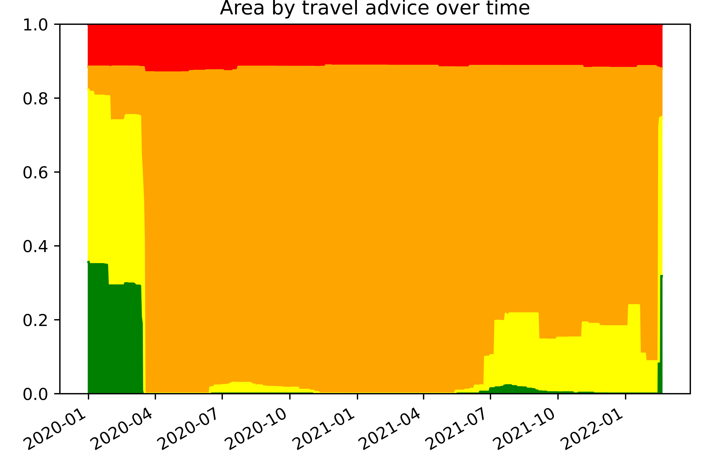

# Dutch Travel Advices

This is a hobby project to visualize the travel advices given by the Dutch Ministry of Foreign Affairs, as well as learning more about creating maps (using geopandas) and creating gifs (using imageio).

This is not in any way linked to the Dutch Ministry of Foreign Affairs.

Sources for the maps:
* [The travel advice maps that can be found through this page](https://www.nederlandwereldwijd.nl/help/in-welke-taal-communiceert-welk-land).
* [The twitter page of the Dutch Ministry of Foreign Affairs](https://twitter.com/247BZ) (for some older data).

## Maps and plots
Below a gif version:

Or below this the most recent jpg version:

Or want more quantified way? Here how much area is what color in the map (excluding cities):

And another fun thing where I average them (which ofcourse should not be done with ordinal data, but fun nevertheless):

## Notes:
Because I rely on the natural earth data, specificically the [admin 1](https://www.naturalearthdata.com/downloads/10m-cultural-vectors/10m-admin-1-states-provinces/), the disputed territories and the populated places, this makes it harder to perfectly mirror the maps made by the Dutch Ministry of Foreign Affairs. Therefore I have made a list of all countries where this is not (yet) perfect.

General note, I only started after the 10th of March of 2020. So everything before this, is a bit uncertain.

### American Samao

* _(13/03/2020-14/04/2020)_ The map of American Samao was missing, instead the map of american virgin islands was shown. Therefor it is shown as grey.

### Armenia
* _(01/01/2020-now)_ Border zones could not be incooporated.

### Bolivia
* _(21/02/2020-now)_ A small part of Cochabamba was red, but could not be colored based on regions.

### China
* _(01/01/2020-now)_ The region Aksai Chin shows up in the maps of both Pakistan, China and India. Because it is de facto governed by China, the travel advice on the China page is chosen. This no endorsement.
* _(01/01/2020-now)_ Taiwan has its own travel advice map, but is also included in the China map. Because Taiwan is de facto independent, I only use the Taiwan map.
* _(01/01/2020-now)_ Hong Kong is also included in the China map. However, I try to follow the Hong Kong map.
* _(01/01/2020-now)_ Macau is also included in the China map. However, I try to follow the Macau map.

### Ethiopia
* Part of Somali region is orange.
* A lot of stuff is actually transregions.

### Egypt
* _(01/01/2020-now)_ Not all regions have only one colour.
* _(01/01/2020-now)_ The Hala'ib triangle should be red, but I don't have a polygon for that yet.

### Georgia
* _(01/01/2020-now)_ Borders are incorrect.

### Germany
* _(28/10/2020-now)_ The city of Aachen has orange travel advice, but is not in the list of cities.

### Hong Kong
* _(01/01/2020-now)_ Hong Kong is also included in the China map. However, I try to follow the Hong Kong map.

### India
* _(01/01/2020-now)_ The region Aksai Chin shows up in the maps of both Pakistan, China and India. Because it is de facto governed by China, the travel advice on the China page is chosen. This no endorsement.
* _(01/01/2020-now)_ Jammu and Kashmir overlap with Pakistan

### Indonesia
* Vulcanoes could not be added
* I could not find the city Donggala
* An area in Antan Jaya is orange which is not in the world map

### Iran
* Individual cities should be added
* Over time has not been incoorperated yet.
* _(01/01/2020-now)_ Abu Musa, Greater Tunb and Lesser Tunb are claimed by UAE, but de facto governed by Iran. Therefor, I will follow the travel advice provided on the Iran page.

### Iraq
* _(10/03/2020-now)_ The borders around Kurdistan are red, but this could not been included in the world map.

### Israel
* _(01/01/2020-now)_ The Golan heights appears both on the Israel and Syria page. It is de facto governed by Israel, so that one is followed.

### Italy
* _(01/01/2020-now)_ The vulcanoes Vesuvius, Stromboli and Etna have red travel advices, could not be included in the world map.

### Ivory Coast
* Borders

### Japan
* _(01/01/2020-now)_ A small area near Fukushima should be red.
* _(??-??)_ I'm not entirely sure when it switched from green to yellow in February/March.

### Lebanon
* _(01/01/2020-now)_ The map is very colorful, which could not completely be mirrored.

### Libia
* Lot of provinces have different colors within one.
* _(01/01/2020-20/02/2020)_ I don't have the city information from this period.

### Macau
* _(01/01/2020-now)_ Macau is also included in the China map. However, I try to follow the Macau map.

### Malaysia
* _(01/01/2020-15/03/2020)_ Sabah was partly yellow and orange, besides the green which it was colored.

### Marocco
* _(01/01/2020-13/03/2020)_ Some cities (including El Hoceima) do not appear in the natural earth dataset, but had a yellow travel advice.

### Mexico
* The border between US and Mexico is not in the world map (except for some cities)
* The city of Ixtapa

### Myanmar
* _(01/01/2020-now)_ Not all cities that have a travel advice different than their surrounding were in the list of cities.

### North Macedonia
* _(01/01/2020-15/03/2020)_ The northern border should have been yellow.

### Pakistan
* _(01/01/2020-now)_ The region Aksai Chin shows up in the maps of both Pakistan, China and India. Because it is de facto governed by China, the travel advice on the China page is chosen. This no endorsement.
* _(01/01/2020-now)_ Jammu and Kashmir overlap with India

### Peru
* _(01/01/2020-13/02/2020)_ Two rivers are orange, but could not be reflected in the world map.
* The border with colombia is orange (26-02-2020), but could not be reflected in the world map.

### Saudi Arabia
* _(01/01/2020-now)_ The border with Yemen is red , but could not be reflected in the world map.
* _(01/01/2020-14/03/2020)_ The border with Iraq is orange, but could not be reflected in the world map.

### Somalia

### Spain
* From 6-7, two small regions were orange. However, it was only possible to color the larger regions that those were part of as a whole.

### Syria
* _(01/01/2020-now)_ The Golan heights appears both on the Israel and Syria page. It is de facto governed by Israel, so that one is followed.

### Taiwan
* Taiwan has its own travel advice map, but is also included in the China map. Because Taiwan is de facto independent, I only use the Taiwan map.

### UAE
* _(01/01/2020-now)_ Abu Musa, Greater Tunb and Lesser Tunb are claimed by UAE, but de facto governed by Iran. Therefor, I will follow the travel advice provided on the Iran page.

